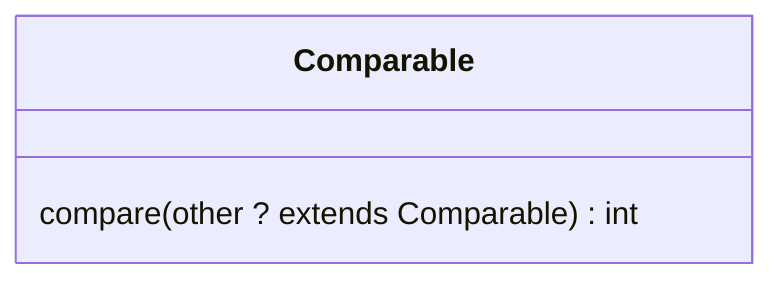
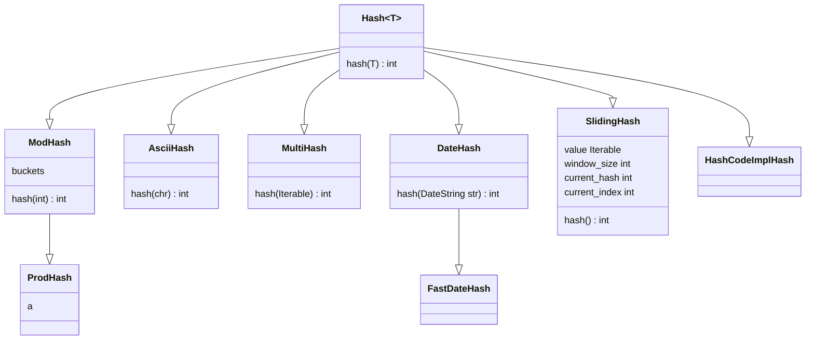
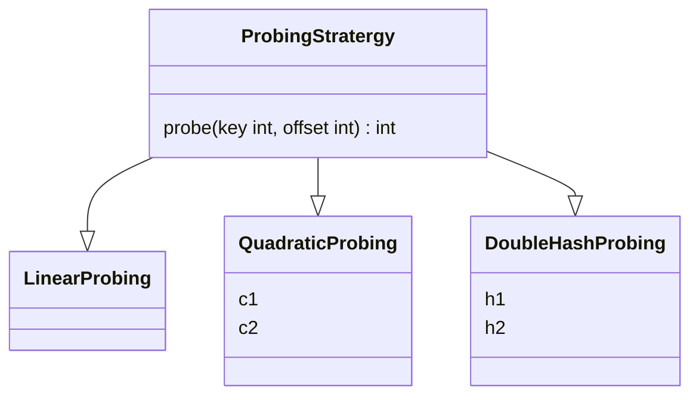
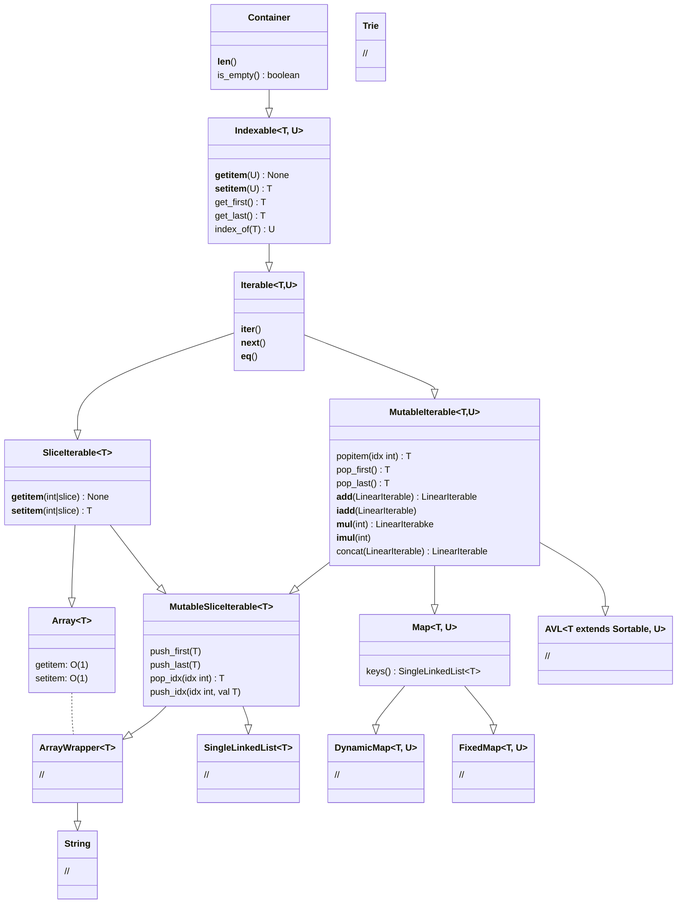

```mermaid
classDiagram
class Comparable{
compare(other ? extends Comparable) int
}
```

```mermaid
classDiagram
class Hash~T~{
hash(T) int
}
class ModHash{
buckets
hash(int) int
}
class ProdHash{
a
}
class AsciiHash{
hash(chr) int
}
class MultiHash{
hash(Iterable) int
}
class DateHash{
hash(DateString str) int
}
class SlidingHash{
value Iterable
window_size int
current_hash int
current_index int
hash() int
}
Hash --|> ModHash
ModHash --|> ProdHash
Hash --|> AsciiHash
Hash --|> MultiHash
Hash --|> DateHash
Hash --|> SlidingHash
Hash --|> HashCodeImplHash
DateHash --|> FastDateHash
```

```mermaid
classDiagram
class ProbingStratergy{
probe(key int, offset int) int
}
class QuadraticProbing{
c1
c2
}
class DoubleHashProbing{
h1
h2
}
ProbingStratergy --|> LinearProbing
ProbingStratergy --|> QuadraticProbing
ProbingStratergy --|> DoubleHashProbing
```

```mermaid
classDiagram
class Container{
__len__()
is_empty() boolean
}
class MutableIterable~T,U~{
popitem(idx int) T
pop_first() T
pop_last() T
__add__(LinearIterable) LinearIterable
__iadd__(LinearIterable)
__mul__(int) LinearIterabke
__imul__(int)
concat(LinearIterable) LinearIterable
}
class Indexable~T, U~{
__getitem__(U) None
__setitem__(U) T
get_first() T
get_last() T
index_of(T) U
}
class Iterable~T,U~{
__iter__()
__next__()
__eq__()
}
class Array~T~{
getitem: O(1)
setitem: O(1)
}
class MutableSliceIterable~T~{
push_first(T)
push_last(T)
pop_idx(idx int) T
push_idx(idx int, val T)
}
class SliceIterable~T~{
__getitem__(int|slice) None
__setitem__(int|slice) T
}
class Map~T, U~{
keys() SingleLinkedList~T~
}
class ArrayWrapper~T~{
//
}
class String{
//
}
class SingleLinkedList~T~{
//
}
class DynamicMap~T, U~{
//
}
class FixedMap~T, U~{
//
}
class AVL~T extends Sortable, U~{
//
}
class Trie{
//
}
Container --|> Indexable
Indexable --|> Iterable
Iterable --|> MutableIterable
MutableIterable --|> Map
MutableIterable --|> AVL
Iterable --|> SliceIterable
MutableIterable --|> MutableSliceIterable
SliceIterable --|> MutableSliceIterable
MutableSliceIterable --|> ArrayWrapper
MutableSliceIterable --|> SingleLinkedList
SliceIterable --|> Array
Map --|> DynamicMap
Map --|> FixedMap
Array .. ArrayWrapper
ArrayWrapper --|> String
```
